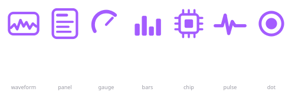

# Conky Fedora

Painel de monitoramento em Conky para **Fedora Rawhide + KDE Plasma (Wayland)**, denso e
em inglês, com fonte bitmap pequena. Feito para caber inteiro numa tela 1080p sem cortar.

Cobre CPU (barra por thread e consumo em watts), GPU NVIDIA, memória, VRM/placa,
armazenamento com modelo real dos discos, bateria de headset sem fio e uma seção de rede
detalhada.

Junto vai um **ícone de bandeja** para ligar, desligar e agendar o painel — com sete
estilos de ícone e nove esquemas de cor.



```
fedora            Linux 7.3.0-0.rc0.260819gbd5f485f3f02.5.fc46 on x86_64
Fedora Linux 46                    up 1d 10h 21m            since 14:34
Tasks 450/0       Threads 1631     Pkgs 2995    Failed 0    KDE Wayland

CPU ─ ─ ─ ─ ─ ─ ─ ─ ─ ─ ─ ─ ─ ─ ─ ─ ─ ─ ─ ─ ─ ─ ─ ─ ─ ─ ─ ─ ─ ─ ─ ─ ─
AMD Ryzen 7 9800X3D                                          gov epp
Usage    1%   ▓▓░░░░░░░░░░░░░░░░░░░░░░░░░░░░░░░░░░░░░░░░░░░░░░░░░░░░░
Freq     5.38 GHz    Boost 5.46 GHz    Temp 50°C    Fans 1510/1500
Ctx/s    19214       Intr/s 7717       Power 37.3W  Load 0.12 0.93 0.98
[  gráfico de uso da CPU, gradiente roxo                             ]
00▓▓░ 01▓░░ 02▓▓░ 03░░░ 04▓░░ 05░░░ 06▓░░ 07░░░
08░░░ 09▓░░ 10░░░ 11▓▓░ 12░░░ 13▓░░ 14░░░ 15░░░
By CPU            PID       CPU%     MEM%      RES
...
```

## Instalação

### Fedora / Fedora KDE, Nobara e outras distros RPM

```bash
sudo dnf install ./conky-fedora-panel-1.1.0-1.fc46.noarch.rpm
systemctl --user enable --now conky-panel-tray
```

### Arch, CachyOS, EndeavourOS, Manjaro

```bash
sudo pacman -U ./conky-fedora-panel-1.1.0-1-any.pkg.tar.zst
systemctl --user enable --now conky-panel-tray
```

Ou pela receita, que é a rota canônica no Arch:

```bash
cd packaging/arch && makepkg -si
```

Os pacotes **não** se auto-habilitam: são unidades de sessão, por usuário. Suba o tray com
a linha acima e ligue o painel pelo menu dele — ou, se preferir sem bandeja:

```bash
systemctl --user enable --now conky-fedora-panel
```

### Sem pacote: instalar da fonte

```bash
./install.sh              # instala em ~/.config e ~/.local, sem root
./install.sh --remove
```

### Gerando os pacotes

```bash
./packaging/build-packages.sh     # escreve dist/*.rpm e dist/*.pkg.tar.zst
```

Precisa de `rpmbuild` para o RPM. O pacote do Arch é montado com `bsdtar` + `zstd`, para
poder sair de uma máquina que não é Arch; o `PKGBUILD` continua sendo a receita oficial.

## O ícone de bandeja

| | |
|---|---|
| **Painel** | liga e desliga, e o ícone reflete o estado — nos estilos de onda a linha fica reta quando está parado |
| **Reiniciar painel** | depois de editar a config |
| **Iniciar no login** | dois interruptores separados, um para o painel e um para o próprio tray |
| **Ícone** | sete estilos: onda, cartão, ponteiro, barras, chip, pulso, ponto |
| **Cor** | nove esquemas |
| **Editar config** | abre `~/.config/conky/pride/pride.conf` no teu editor |
| **Restaurar config** | volta para a versão do pacote, guardando a tua como `.bak` |
| **Ligar leitura de consumo da CPU** | instala a regra udev do RAPL, via `pkexec` — só aparece quando falta |

A config é copiada para `~/.config/conky/pride/` na primeira execução e **nunca é
sobrescrita** por atualização de pacote. O que o pacote guarda em
`/usr/share/conky-fedora-panel/` é a cópia intocada, usada só para restaurar.

O tray também percebe um conky rodando a tua config **fora do serviço** (autostart antigo,
ou lançado à mão) e avisa; ao ligar pelo menu ele assume o controle.

## Requisitos

| | |
|---|---|
| `conky` | ≥ 1.10 (sintaxe Lua); testado no 1.24 |
| `python3-pyside6` | só para o ícone de bandeja |
| Fonte | Terminus TTF — `ax86-terminus-ttf-fonts` no Fedora |
| `lm_sensors` | temperaturas de placa, RPM das fans e tensões |
| `nvidia-smi` | a seção GPU, se você tiver NVIDIA |
| Bandeja | qualquer uma que fale StatusNotifierItem — KDE e a maioria das barras de Wayland |

## Documentação

1. **[Construindo do zero](docs/01-construindo-do-zero.md)** — o passo a passo, da janela
   vazia ao painel completo: sintaxe, alinhamento em pixels, barras, gráficos, e como
   medir se cabe na tela.
2. **[O que coletar e de onde](docs/02-o-que-coletar.md)** — catálogo das fontes de dado:
   o que o conky já sabe ler sozinho e o que exige script.
3. **[Armadilhas](docs/03-armadilhas.md)** — os problemas reais que apareceram montando
   isso, com o diagnóstico e o conserto de cada um. É a parte que economiza mais tempo.
4. **[O ícone de bandeja](docs/04-tray.md)** — como ele controla o painel, e como
   desenhar ícones que se leem em 22px.

## Este painel assume um hardware

Está calibrado para a máquina onde foi feito. Os pontos a trocar estão listados em
[docs/01](docs/01-construindo-do-zero.md#adaptando-para-outro-hardware):

- CPU AMD (sensor `k10temp`) com 16 threads
- GPU NVIDIA (via `nvidia-smi`)
- Super I/O `nct6799` (temperaturas de placa e RPM das fans)
- interface de rede `enp7s0`
- montagens `/`, `/boot`, `/mnt/samsung-980pro`, `/mnt/ssd-kingston`
- headset Corsair VOID (driver `hid-corsair-void`, kernel ≥ 6.13)

Nada disso é obrigatório: cada seção é independente e pode sair da config sem quebrar o
resto.

## Licença

MIT.
